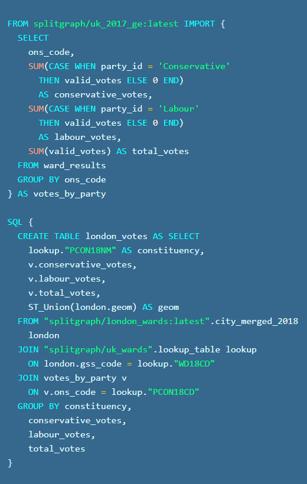

# Splitgraph

[](https://coveralls.io/github/splitgraph/splitgraph?branch=master)
[](https://badge.fury.io/py/splitgraph)
[](https://discord.gg/4Qe2fYA)
[](https://twitter.com/Splitgraph)

## Overview

**Splitgraph** is a tool for building, versioning and querying reproducible datasets. It's inspired
by Docker and Git, so it feels familiar. And it's powered by [PostgreSQL](https://postgresql.org), so it [works seamlessly with existing tools](https://www.splitgraph.com/connect) in the Postgres ecosystem. Use Splitgraph to package your data into self-contained **data images** that you can [share with other Splitgraph instances](https://www.splitgraph.com/docs/getting-started/decentralized-demo).

[**Splitgraph.com**](https://www.splitgraph.com), or **Splitgraph Cloud**, is a public Splitgraph instance where you can share and discover data. It's a Splitgraph peer powered by the **Splitgraph Core** code in this repository, adding proprietary features like a data catalog, multitenancy, and a distributed SQL proxy.

You can explore [40k+ open datasets](https://www.splitgraph.com/explore) in the catalog. You can also connect directly to the [Data Delivery Network](https://www.splitgraph.com/connect) and query any of the datasets, without installing anything.

To install `sgr` (the command line client) or a local Splitgraph Engine, see the [Installation](#installation) section of this readme.

### Build and Query Versioned, Reproducible Datasets

[**Splitfiles**](https://www.splitgraph.com/docs/concepts/splitfiles) give you a declarative language, inspired by Dockerfiles, for expressing data transformations in ordinary SQL familiar to any researcher or business analyst. You can reference other images, or even other databases, with a simple JOIN.



When you build data with Splitfiles, you get provenance tracking of the resulting data: it's possible to find out what sources went into every dataset and know when to rebuild it if the sources ever change. You can easily integrate Splitgraph into your existing CI pipelines, to keep your data up-to-date and stay on top of changes to upstream sources.

Splitgraph images are also version-controlled, and you can manipulate them with Git-like operations through a CLI. You can check out any image into a PostgreSQL schema and interact with it using any PostgreSQL client. Splitgraph will capture your changes to the data, and then you can commit them as delta-compressed changesets that you can package into new images.

Splitgraph supports PostgreSQL [foreign data wrappers](https://wiki.postgresql.org/wiki/Foreign_data_wrappers). We call this feature [mounting](https://www.splitgraph.com/docs/concepts/mounting). With mounting, you can query other databases (like PostgreSQL/MongoDB/MySQL) or open data providers (like [Socrata](https://www.splitgraph.com/docs/ingesting-data/socrata)) from your Splitgraph instance with plain SQL. You can even snapshot the results or use them in Splitfiles.

### Why Splitgraph?

Splitgraph isn't opinionated and doesn't break existing abstractions. To any existing PostgreSQL application, Splitgraph images are just another database. We have carefully designed Splitgraph to not break the abstraction of a PostgreSQL table and wire protocol, because doing otherwise would mean throwing away a vast existing ecosystem of applications, users, libraries and extensions. This means that a lot of tools that work with PostgreSQL work with Splitgraph out of the box.


## Components

The code in this repository, known as **Splitgraph Core**, contains:

- **[`sgr` command line client](https://www.splitgraph.com/docs/architecture/sgr-client)**: `sgr` is the main command line tool used to work with Splitgraph "images" (data snapshots). Use it to ingest data, work with splitfiles, and push data to Splitgraph.com.
- **[Splitgraph Engine](engine/README.md)**: a [Docker image](https://hub.docker.com/r/splitgraph/engine) of the latest Postgres with Splitgraph and other required extensions pre-installed.
- **[Splitgraph Python library](https://www.splitgraph.com/docs/python-api/splitgraph.core)**: All Splitgraph functionality is available in the Python API, offering first-class support for data science workflows including Jupyter notebooks and Pandas dataframes.

## Docs

Documentation is available at https://www.splitgraph.com/docs, specifically:

- [Installation](https://www.splitgraph.com/docs/getting-started/installation)
- [FAQ](https://www.splitgraph.com/docs/getting-started/frequently-asked-questions)

We also recommend reading our Blog, including some of our favorite posts:

- [Supercharging `dbt` with Splitgraph: versioning, sharing, cross-DB joins](https://www.splitgraph.com/blog/dbt)
- [Querying 40,000+ datasets with SQL](https://www.splitgraph.com/blog/40k-sql-datasets)
- [Foreign data wrappers: PostgreSQL's secret weapon?](https://www.splitgraph.com/blog/foreign-data-wrappers)

## Installation

Pre-requisites:

- Docker is required to run the Splitgraph Engine. `sgr` must have access to Docker. You either need to [install Docker locally](https://docs.docker.com/install/) or have access to a remote Docker socket.

For Linux and OSX, once Docker is running, install Splitgraph with a single script:

```
$ bash -c "$(curl -sL https://github.com/splitgraph/splitgraph/releases/latest/download/install.sh)"
```

This will download the `sgr` binary and set up the Splitgraph Engine Docker container.

Alternatively, you can get the `sgr` single binary from [the releases page](https://github.com/splitgraph/splitgraph/releases) and run [`sgr engine add`](https://www.splitgraph.com/docs/sgr/engine-management/engine-add) to create an engine.

See the [installation guide](https://www.splitgraph.com/docs/getting-started/installation) for more installation methods.

## Quick start guide

You can follow the [quick start guide](https://www.splitgraph.com/docs/getting-started/five-minute-demo) that will guide you through the basics of using Splitgraph with public and private data.

Alternatively, Splitgraph comes with plenty of [examples](examples) to get you started.

If you're stuck or have any questions, check out the [documentation](https://www.splitgraph.com/docs/) or join our [Discord channel](https://discord.gg/4Qe2fYA)!

## Contributing

### Setting up a development environment

  * Splitgraph requires Python 3.6 or later.
  * Install [Poetry](https://github.com/python-poetry/poetry): `curl -sSL https://raw.githubusercontent.com/python-poetry/poetry/master/get-poetry.py | python` to manage dependencies
  * Install pre-commit hooks (we use [Black](https://github.com/psf/black) to format code)
  * `git clone --recurse-submodules https://github.com/splitgraph/splitgraph.git`
  * `poetry install`
  * To build the [engine](https://www.splitgraph.com/docs/architecture/splitgraph-engine) Docker image: `cd engine && make`

### Running tests

The test suite requires [docker-compose](https://github.com/docker/compose). You will also
need to add these lines to your `/etc/hosts` or equivalent:

```
127.0.0.1       local_engine
127.0.0.1       remote_engine
127.0.0.1       objectstorage
```

To run the core test suite, do

```
docker-compose -f test/architecture/docker-compose.core.yml up -d
poetry run pytest -m "not mounting and not example"
```

To run the test suite related to "mounting" and importing data from other databases
(PostgreSQL, MySQL, Mongo), do

```
docker-compose -f test/architecture/docker-compose.core.yml -f test/architecture/docker-compose.mounting.yml up -d
poetry run pytest -m mounting
```

Finally, to test the [example projects](https://github.com/splitgraph/splitgraph/tree/master/examples), do

```
# Example projects spin up their own engines
docker-compose -f test/architecture/docker-compose.core.yml -f test/architecture/docker-compose.core.yml down -v
poetry run pytest -m example
```

All of these tests run in [CI](https://github.com/splitgraph/splitgraph/actions).
