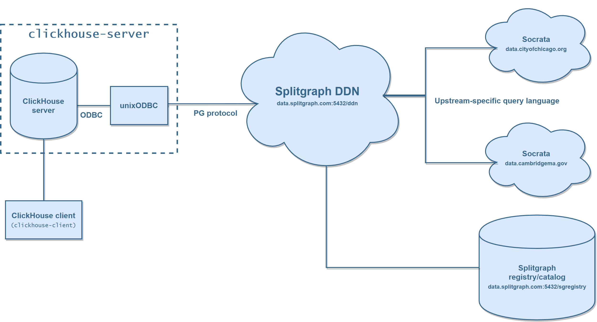
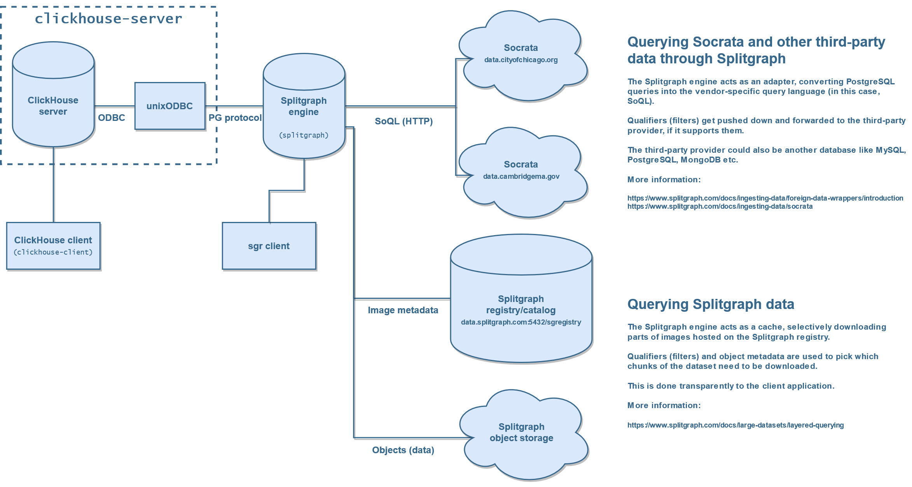

# Using Splitgraph data in ClickHouse

This example will show you a workflow for connecting to Splitgraph through ODBC, letting you query
Splitgraph data from anything that supports ODBC. This includes datasets hosted by Splitgraph as well as
ones hosted by third party vendors (for example, [Socrata](https://www.splitgraph.com/docs/ingesting-data/socrata)).

In this case, we will be using [ClickHouse](https://clickhouse.tech), a fast open-source column-oriented database management system,
to query Splitgraph data through ODBC.

This uses [unixODBC](http://www.unixodbc.org/) and ClickHouse's [ODBC functionality](https://clickhouse.tech/docs/en/engines/table-engines/integrations/odbc/).

We will show querying the [Splitgraph DDN](https://www.splitgraph.com/connect) directly without having to install Splitgraph,
as well as running a Splitgraph engine locally and querying data through it, avoiding DDN query limits. 

## Prerequisites

You will need Docker and Docker Compose.

The Docker Compose stack contains:

  * The Splitgraph engine
  * An instance of the ClickHouse server with unixODBC installed
  * ClickHouse client

### Setup

The ODBC configuration lives in the [clickhouse/odbc.ini](clickhouse/odbc.ini) file. If you
want to use the Splitgraph DDN, [register](https://www.splitgraph.com/connect) on Splitgraph and 
paste your API key/secret into the `UserName` and `Password` fields in the `splitgraph-ddn` section.

Start the stack. This will build ClickHouse with ODBC configured and start the Splitgraph engine (not required
for the first part but we'll be using it in the second part).

```shell-session
$ docker-compose up -d --build
```

### Splitgraph DDN

This section showcases data access through the [Splitgraph DDN](https://www.splitgraph.com/connect): you can
connect to it with most PostgreSQL clients without having to install anything else and query Splitgraph
datasets by referencing them as PostgreSQL schemas.

](./splitgraph-ddn-odbc-clickhouse.png)

#### odbc() function

The [`odbc()`](https://clickhouse.tech/docs/en/sql-reference/table-functions/odbc/) table function lets you reference ODBC tables directly in ClickHouse.

Start the ClickHouse client and run a simple query that references Splitgraph through ODBC:

```bash
$ docker-compose run --rm clickhouse-client

ClickHouse client version 20.5.2.7 (official build).
Connecting to clickhouse-server:9000 as user default.
Connected to ClickHouse server version 20.5.2 revision 54435.


538c1b6dd221 :) SELECT
    engine,
    address
FROM odbc('DSN=splitgraph_ddn',
'cityofchicago/fire-stations-28km-gtjn', 'fire_stations') LIMIT 10;

SELECT 
    engine,
    address
FROM odbc('DSN=splitgraph_ddn', 'cityofchicago/fire-stations-28km-gtjn', 'fire_stations')
LIMIT 10

┌─engine─┬─address───────────────┐
│ E73    │ 8630 S EMERALD AVE    │
│ E4     │ 548 W DIVISION ST     │
│ E64    │ 7659 S PULASKI RD     │
│ E43    │ 2179 N STAVE ST       │
│ E70/59 │ 6030 N CLARK ST       │
│ E71    │ 6239 N CALIFORNIA AVE │
│ E124   │ 4426 N KEDZIE AVE     │
│ E69    │ 4017 N TRIPP AVE      │
│ E22    │ 605 W ARMITAGE AVE    │
│ E103   │ 25 S LAFLIN ST        │
└────────┴───────────────────────┘

10 rows in set. Elapsed: 1.235 sec. 
```

In general, you can reference any dataset on Splitgraph through the `odbc()` function like this:

```
odbc('DSN=splitgraph_ddn', 'namespace/repository', 'table_name')
```

The `odbc()` function can push down predicates too, but it doesn't push down ORDER and LIMIT clauses. Since
the Splitgraph DDN limits all queries to 10k rows, this can cause some unintuitive results. You can sometimes get around
this with stricter predicates:

```sql
SELECT
    time,
    screen_name,
    text
FROM
    odbc('DSN=splitgraph_ddn', 'splitgraph/congress_tweets', 'tweets')
WHERE time > '2020-08-31 00:00:00' ORDER BY time DESC LIMIT 10;
``` 

#### Advanced ODBC operations: remapping types and joining between multiple datasets

When you need to alter the table definitions that the ODBC adapter uses, you can create a table
on ClickHouse that uses the [ODBC engine](https://clickhouse.tech/docs/en/engines/table-engines/integrations/odbc/).

In case of Splitgraph, this can be useful for timeseries data, as it can return it in a format not parseable by ClickHouse.

In this example, we'll reproduce the [Socrata Metabase](https://www.splitgraph.com/docs/ingesting-data/socrata#using-metabase-to-join-and-plot-data-from-multiple-data-portals)
example that joins data between the Chicago and the Cambridge Socrata data portals, plotting the number
of coronavirus cases in both cities.

Go to the ClickHouse client and create the ODBC tables:

```sql
CREATE TABLE chicago_cases (
        lab_report_date String,
        cases_total Int32
)
ENGINE = ODBC(
	'DSN=splitgraph_ddn',
	'cityofchicago/covid19-daily-cases-deaths-and-hospitalizations-naz8-j4nc',
	'covid19_daily_cases_deaths_and_hospitalizations'
);

CREATE TABLE cambridge_cases (
        date String,
        new_positive_cases Int32
)
ENGINE = ODBC(
	'DSN=splitgraph_ddn',
	'cambridgema-gov/covid19-case-count-by-date-axxk-jvk8',
	'covid19_case_count_by_date'
);
```

Here, we're only interested in the date and number of cases columns. In addition, we treat them
as `String` and will parse them ourselves in ClickHouse.

You can now run JOIN queries between these tables as normal:

```
538c1b6dd221 :) SELECT
:-]     parseDateTimeBestEffortOrNull(cambridge_cases.date) AS date,
:-]     chicago_cases.cases_total AS chicago_daily_cases,
:-]     cambridge_cases.new_positive_cases AS cambridge_daily_cases
:-] FROM
:-]     chicago_cases
:-] FULL OUTER JOIN
:-]     cambridge_cases
:-] ON
:-]     parseDateTimeBestEffortOrNull(chicago_cases.lab_report_date) = parseDateTimeBestEffortOrNull(cambridge_cases.date)
:-] ORDER BY date DESC LIMIT 10;

SELECT 
    parseDateTimeBestEffortOrNull(cambridge_cases.date) AS date,
    chicago_cases.cases_total AS chicago_daily_cases,
    cambridge_cases.new_positive_cases AS cambridge_daily_cases
FROM chicago_cases
FULL OUTER JOIN cambridge_cases ON parseDateTimeBestEffortOrNull(chicago_cases.lab_report_date) = parseDateTimeBestEffortOrNull(cambridge_cases.date)
ORDER BY date DESC
LIMIT 10

┌────────────────date─┬─chicago_daily_cases─┬─cambridge_daily_cases─┐
│ 2020-08-31 00:00:00 │                   0 │                     0 │
│ 2020-08-30 00:00:00 │                   8 │                     0 │
│ 2020-08-29 00:00:00 │                  64 │                     1 │
│ 2020-08-28 00:00:00 │                 248 │                     4 │
│ 2020-08-27 00:00:00 │                 307 │                     2 │
│ 2020-08-26 00:00:00 │                 346 │                     2 │
│ 2020-08-25 00:00:00 │                 362 │                     4 │
│ 2020-08-24 00:00:00 │                 514 │                     2 │
│ 2020-08-23 00:00:00 │                 107 │                     0 │
│ 2020-08-22 00:00:00 │                 183 │                     1 │
└─────────────────────┴─────────────────────┴───────────────────────┘

10 rows in set. Elapsed: 0.425 sec. 
```

We use the [`parseTimeBestEffortOrNull`](https://clickhouse.tech/docs/en/sql-reference/functions/type-conversion-functions/#parsedatetimebesteffortornull) function here
to let ClickHouse parse date formats with slashes that Socrata uses.

### Local Splitgraph engine

To avoid DDN query limits as well as speed up some queries to Splitgraph-hosted datasets by downloading them, you can
run Splitgraph locally. The Compose stack already has a Splitgraph engine running.

Here is an architecture diagram of this setup:

](./splitgraph-odbc-clickhouse.png)

We will run the same queries that we ran in the DDN example, as well as:
 
   * query the [2016 US election](https://www.splitgraph.com/splitgraph/2016_election/) dataset through [layered querying](https://www.splitgraph.com/docs/large-datasets/layered-querying), lazily downloading table fragments on the fly.
   * load the dataset into ClickHouse for faster analytics.

#### Setup

Initialize the engine and set up some datasets (the setup script lives in [setup_datasets.sh](./setup_datasets.sh)). This will set up local "mounts" of the same
datasets that we referenced in the previous part:

  * Chicago Fire Stations Socrata dataset in `chicago_data.fire_stations`
  * Foreign tables for the full Chicago Open Data Socrata domain in `chicago`
  * Foreign tables for the full Cambridge Open Data Socrata domain in `cambridge`
  
In this case, your local engine will have a few instances of the [Socrata Foreign Data Wrapper](https://www.splitgraph.com/docs/ingesting-data/socrata) pointing to the upstream data portals.

You will also be prompted to log into Splitgraph with your API keys to clone the metadata for the sample dataset ([2016 US Election precinct-level returns](https://www.splitgraph.com/splitgraph/2016_election/))

```bash
$ ./setup_datasets.sh

Initializing engine PostgresEngine LOCAL (sgr@localhost:5432/splitgraph)...
Database splitgraph already exists, skipping
Ensuring the metadata schema at splitgraph_meta exists...
Running splitgraph_meta--0.0.1.sql
Running splitgraph_meta--0.0.1--0.0.2.sql
Running splitgraph_meta--0.0.2--0.0.3.sql
Installing Splitgraph API functions...
Installing CStore management functions...
Installing the audit trigger...
Engine PostgresEngine LOCAL (sgr@localhost:5432/splitgraph) initialized.

Mounting Socrata domain...
Getting Socrata metadata
warning: Requests made without an app_token will be subject to strict throttling limits.
Loaded metadata for 1 Socrata table

Mounting Socrata domain...
Getting Socrata metadata
Loaded metadata for 515 Socrata tables

Mounting Socrata domain...
Getting Socrata metadata
warning: Requests made without an app_token will be subject to strict throttling limits.
Loaded metadata for 137 Socrata tables
```

#### Querying datasets from the DDN example

The local Splitgraph instance is already set up in the [clickhouse/odbc.ini](clickhouse/odbc.ini) file as the `splitgraph` DSN:

```sql
SELECT 
    engine,
    address
FROM odbc('DSN=splitgraph', 'chicago_data', 'fire_stations');

CREATE TABLE chicago_cases (
	lab_report_date String,
	cases_total Int32	
)
ENGINE = ODBC('DSN=splitgraph', 'chicago', 'covid19_daily_cases_deaths_and_hospitalizations_naz8_j4nc');
```

#### Layered querying

When running Splitgraph locally, you can use [layered querying](https://www.splitgraph.com/docs/large-datasets/layered-querying)
to query remote datasets hosted on Splitgraph by only downloading required objects.

Go back to the ClickHouse client and query the 2016 US election dataset:

```
538c1b6dd221 :) SELECT candidate_normalized,
    SUM(votes) AS votes
FROM odbc('DSN=splitgraph', 'splitgraph/2016_election', 'precinct_results')
WHERE state_postal = 'TX' GROUP BY candidate_normalized ORDER BY votes DESC;

SELECT 
    candidate_normalized,
    SUM(votes) AS votes
FROM odbc('DSN=splitgraph', 'splitgraph/2016_election', 'precinct_results')
WHERE state_postal = 'TX'
GROUP BY candidate_normalized
ORDER BY votes DESC

┌─candidate_normalized─┬───votes─┐
│ trump                │ 4684288 │
│ clinton              │ 3877626 │
│ johnson              │  283462 │
│ stein                │   71546 │
│ mcmullin             │   42366 │
│ castle               │    4261 │
│ maturen              │    1401 │
│ kotlikoff            │    1037 │
│ hoefling             │     932 │
│ valdivia             │     428 │
│ cubbler              │     314 │
│ morrow               │     145 │
│ moorehead            │     122 │
│ soltysik             │      72 │
│ steffes              │      71 │
│ lee                  │      67 │
│ fox                  │      45 │
└──────────────────────┴─────────┘

17 rows in set. Elapsed: 0.639 sec. Processed 39.07 thousand rows, 1.45 MB (61.10 thousand rows/s., 2.27 MB/s.) 
```

By running `sgr status`, you can see that this query only downloaded 2.64MiB of data out of 26.81MiB:

```shell-session
$ docker-compose exec -T splitgraph sgr status

Local repositories: 

Repository                  Images    Tags  Size (T)    Size (A)    Checkout         Upstream
------------------------  --------  ------  ----------  ----------  ---------------  ----------------------------------------------
splitgraph/2016_election         1       1  26.81 MiB   2.64 MiB    3835145ada (LQ)  splitgraph/2016_election (data.splitgraph.com)
```

This is because ClickHouse pushed the `state_postal = 'TX'` filter through the ODBC connection to Splitgraph,
so Splitgraph could use its own metadata to limit the number of objects it needed to download.

#### Loading data into ClickHouse

You can also load data from Splitgraph directly into ClickHouse for faster querying. For example, let's load the full
2016 Election dataset (2M rows):

```
CREATE TABLE sg_2016_election (
	state_postal String,
	state_fips String,
	county_name String,
	county_fips String,
	candidate_normalized String,
	mode String,
	votes Int32
)
ENGINE = ODBC('DSN=splitgraph', 'splitgraph/2016_election', 'precinct_results');

CREATE TABLE ch_2016_election AS sg_2016_election ENGINE MergeTree ORDER BY county_fips;

INSERT INTO ch_2016_election SELECT * FROM sg_2016_election;
```

You can now run queries directly in ClickHouse, without Splitgraph getting involved:

```sql
538c1b6dd221 :)
    SELECT candidate_normalized,
SUM(votes) AS total_votes
FROM ch_2016_election
GROUP BY candidate_normalized
ORDER BY total_votes DESC LIMIT 5;

SELECT 
    candidate_normalized,
    SUM(votes) AS total_votes
FROM ch_2016_election
GROUP BY candidate_normalized
ORDER BY total_votes DESC
LIMIT 5

┌─candidate_normalized─┬─total_votes─┐
│ clinton              │    65851676 │
│ trump                │    62980404 │
│ johnson              │     4487536 │
│ stein                │     1452499 │
│ ticket               │     1283760 │
└──────────────────────┴─────────────┘

5 rows in set. Elapsed: 0.804 sec. Processed 1.99 million rows, 38.10 MB (2.47 million rows/s., 47.40 MB/s.) 
```

## Further reading

  * [ClickHouse ODBC documentation](https://clickhouse.tech/docs/en/engines/table-engines/integrations/odbc/)
  * [unixODBC](http://www.unixodbc.org/)
  * [Splitgraph data delivery network documentation](https://www.splitgraph.com/docs/splitgraph-cloud/data-delivery-network)
  * [Splitgraph Socrata documentation](https://www.splitgraph.com/docs/ingesting-data/socrata)
  * [Splitgraph layered querying](https://www.splitgraph.com/docs/large-datasets/layered-querying)
