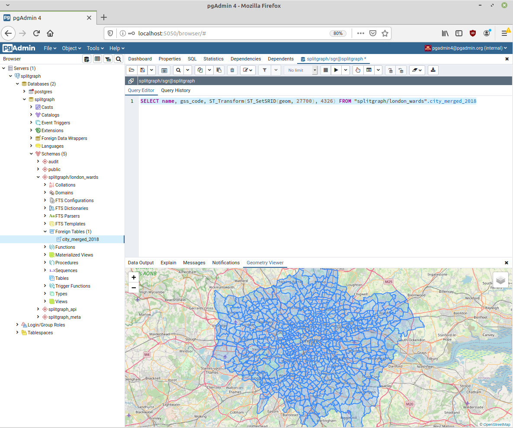

# Using Splitgraph with pgAdmin

Since the Splitgraph engine is a PostgreSQL instance, most SQL clients will be able to
connect to it and read/write to checked out Splitgraph tables without issues.

This example will:

  * start a [pgAdmin](https://www.pgadmin.org/) Docker container and a Splitgraph engine and
    connect them to each other
  * Use pgAdmin to explore the Splitgraph engine, pulling some datasets from Splitgraph and
    examining them.

## Running the example

  * Copy your `.sgconfig` file to this directory and set the engine password (`SG_ENGINE_PWD`) to `supersecure`.
  * Start the containers: `./setup.sh`
  * Clone the [London Wards](https://web.splitgraph.com/splitgraph/london_wards/) dataset:
    * `sgr clone splitgraph/london_wards`
  * Check out the dataset using layered querying (as a set of foreign tables: no data will be
    downloaded until the first query):
    * `sgr checkout --layered splitgraph/london_wards:latest`
  * Connect to pgAdmin by going to http://localhost:5050
    * User: `pgadmin4@pgadmin.org`
    * Password: `password`
  * Open the Splitgraph database in the left sidebar (you might need to enter the default engine password, `supersecure`)
  
The dataset is checked out into a PostgreSQL schema `splitgraph/london_wards` and you can now run
queries against it as usual (Tools -> Query tool), prefixing its tables with the schema name. For example:

```sql
SELECT name, gss_code, ST_Transform(ST_SetSRID(geom, 27700), 4326) FROM "splitgraph/london_wards".city_merged_2018
```


